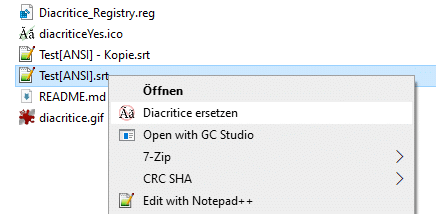

# 🔄 Diacritice

**en:** `Create a context-menu in Windows-Explorer for translate ANSII-text-files to UTF-8 formattet text with the corected romanian Diacritics`

**de:** `Erstellen Sie einen Kontextmenüeintrag im Windows-Explorer, um ASCII-Textdateien in UTF-8-formatierten Text mit den korrekten rumänischen diakritischen Zeichen zu übersetzen`

**ro:** `Creați o intrare în meniul contextual în Windows Explorer pentru a traduce fișierele text ASCII în text formatat UTF-8 cu diacriticele corecte în limba românească`

---
---

## 🚀 Problematik

Noch immer sind die meisten Untertiteldateien, die Sie im Internet für die rumänische Sprache finden (meist `.srt`), nur im veralteten ASCII-Format erhältlich. Die rumänischen Sonderzeichen (Diacritice) werden dann weder im Texteditor noch auf dem Smartfernseher leserlich dargestellt. Das Programm `Diacritice` wandelt nun diese Zeichen mit einem Rechtsklick um!

## 💾 Installation

Laden Sie das Repository herunter, entweder im Repository auf `<> Code` und dann `Download ZIP`, oder direkt [hier](https://github.com/Chregu73/Diacritice/archive/refs/heads/main.zip). Entpacken Sie die Dateien diacritice.ico und Diacritice.exe aus einem der beiden Verzeichnisse, je nach gewünschter Sprache in ein Verzeichnis Ihrer Wahl, z.B. Dokumente `C:\Users\[User]\Documents\`.

### 🛠️ Symbol in das Kontextmenü einfügen

Sie können Ihrem Kontextmenü-Eintrag im Windows Explorer ein Symbol (Icon) hinzufügen, indem Sie die Windows-Registrierungsdatenbank (Registry) entsprechend anpassen.

### ⚙️ 1. Registrierungsschlüssel für Ihre Anwendung

Erstellen Sie einen neuen Schlüssel direkt unter **`HKEY_CLASSES_ROOT\*\shell`**. Diesen Schlüssel benennen Sie `Diacritice`.

<pre>
HKEY_CLASSES_ROOT
├── *
│   └── shell
│       └── Diacritice  (<- Das ist der erste Schlüssel, den Sie erstellen)
</pre>

Dieser Schlüssel repräsentiert Ihre Anwendung im Kontextmenü. Sein **Standardwert** legt den Text fest, der im Kontextmenü angezeigt wird, z. B. `Diacritice ersetzen`.

### ⚙️ 2. Befehlsschlüssel

Innerhalb des gerade erstellten Schlüssels (`Diacritice`) müssen Sie einen weiteren Unterschlüssel namens **`command`** erstellen. Dieser Schlüssel enthält den eigentlichen Befehl, der ausgeführt wird, wenn der Benutzer auf Ihren Menüpunkt klickt.

<pre>
HKEY_CLASSES_ROOT
├── *
│   └── shell
│       └── Diacritice
│           └── command   (<- Das ist der zweite Schlüssel)
</pre>

Der **Standardwert** des `command`-Schlüssels muss den Pfad zu Ihrer ausführbaren Datei (`.exe`) und den Platzhalter `"%1"` enthalten.

### ⚙️ 3. Icon-Eintrag hinzufügen

Innerhalb des gleichen `IhreAnwendung`-Schlüssels, aber außerhalb des `command`-Unterschlüssels, erstellen Sie einen neuen **Zeichenfolgenwert** mit dem Namen **`Icon`**.

- **Schlüssel:** `HKEY_CLASSES_ROOT\*\shell\Diacritice`
- **Name:** `Icon`
- **Wert:** `"C:\Pfad\Zu\Ihrer\diacritice.ico"`

### 💡 Zusammenfassung der Struktur

Ihre Registry-Struktur sollte am Ende so aussehen:

**Schlüssel:** `HKEY_CLASSES_ROOT\*\shell\Diacritice`
- **Name:** `(Standard)`
- **Wert:** `"Diacritice ersetzen"` (oder ein anderer gewünschter Text)
- **Name:** `Icon`
- **Wert:** `"C:\Pfad\Zu\Ihrer\diacritice.ico"`

**Schlüssel:** `HKEY_CLASSES_ROOT\*\shell\Diacritice\command`
- **Name:** `(Standard)`
- **Wert:** `"C:\Pfad\Zu\Ihrer\Diacritice.exe" "%1"`

## ✅ Benutzung

Beim **Rechtsklick** auf eine Datei erscheint nun im Kontextmenu der Punkt  `Diacritice ersetzen`. Nach dem Klick auf diesen wird durch die weiteren Schritte geführt. Falls eine UTF-8 Datei erkannt wird, wird mit dem entsprechenden Hinweis abgebrochen.

Intern wird eine neue Datei erstellt, die Zeichen reingeschrieben, die alte Datei gelöscht und die Neue nach der Alten umbenannt. 

### 🛠️ Alternative Methode: Öffnen mit... (Für schnellen Doppelklick auf .srt)

Diese Methode bindet die Konvertierung direkt an den Dateityp `.srt`. Nach der Einrichtung können Sie jede `.srt`-Datei einfach mit einem Doppelklick konvertieren lassen.

**Rechtsklick auf eine** `.srt`**-Datei:** Navigieren Sie zu einer beliebigen `.srt`-Datei auf Ihrem PC (z.B. einer Untertiteldatei).

**Öffnen-mit-Dialog starten:** Klicken Sie mit der rechten Maustaste auf die .srt-Datei und wählen Sie **"Öffnen mit..."** oder **"Andere App auswählen"**.

**Programm auswählen:** Klicken Sie auf **"Nach einer anderen App auf diesem PC suchen"** oder **"Mehr Apps"** und dann auf den Link für eine lokale EXE-Datei.

`Diacritice.exe` **auswählen:** Navigieren Sie zu dem Pfad, in dem Sie die Datei abgelegt haben (z.B. `C:\Users\[User]\Documents\Diacritice_Tool\Diacritice.exe`) und wählen Sie das Programm aus.

**Standard-App festlegen:** ⚠️ **WICHTIG:** Bevor Sie auf "OK" klicken, stellen Sie sicher, dass das Kontrollkästchen **"Immer diese App zum Öffnen von `.srt`-Dateien verwenden"** oder **"Immer diese App zum Öffnen von `.srt`-Dateien verwenden"** (oder eine ähnliche Formulierung) **angekreuzt** ist.

Nachdem Sie dies bestätigt haben, führt jeder **Doppelklick** auf eine `.srt`-Datei die Konvertierung durch das Programm `Diacritice.exe` aus.

---
---

## 🚀 Problema

Încă, cele mai multe fișiere de subtitrare pe care le găsiți pe internet pentru limba română (de obicei `.srt`), sunt disponibile doar în formatul ASCII învechit. Caracterele românești (diacritice) nu sunt atunci afișate lizibil, nici în editorul de text, nici pe televizorul inteligent. Programul `Diacritice` convertește aceste caractere cu un singur clic dreapta!

## 💾 Instalația

Descărcați repository-ul, fie prin `Download ZIP` de pe buton `<> Code`, fie direct de [aici](https://github.com/Chregu73/Diacritice/archive/refs/heads/main.zip). Dezarhivați fișierele `diacritice.ico` și `Diacritice.exe` dintr-unul dintre cele două dosare, în funcție de limba dorită, într-un dosar la alegere, de exemplu Documente `C:\Users\[User]\Documents\`.

### 🛠️ Adăugarea unei pictograme în meniul contextual

Puteți adăuga o pictogramă (icon) la intrarea din meniul contextual în Windows Explorer, prin ajustarea corespunzătoare a Registrului Windows (Registry).

### ⚙️ 1. Cheia de Registru pentru aplicația dumneavoastră

Creați o nouă cheie direct sub **`HKEY_CLASSES_ROOT\*\shell`**. Denumiți această cheie `Diacritice`.

<pre>
HKEY_CLASSES_ROOT
├── *
│   └── shell
│       └── Diacritice  (<- Aceasta este prima cheie pe care o creați)
</pre>

Această cheie reprezintă aplicația dumneavoastră în meniul contextual. **Valoarea** sa **implicită** definește textul care va fi afișat în meniul contextual, de exemplu `Înlocuire diacritice`.

### ⚙️ 2. Cheia de comandă

În cadrul cheii create anterior (`Diacritice`), trebuie să creați o altă sub-cheie numită **`command`**. Această cheie conține comanda propriu-zisă care este executată atunci când utilizatorul face clic pe elementul dumneavoastră de meniu.

<pre>
HKEY_CLASSES_ROOT
├── *
│   └── shell
│       └── Diacritice
│           └── command   (<- Aceasta este a doua cheie)
</pre>

**Valoarea implicită** a cheii `command` trebuie să conțină calea către fișierul dumneavoastră executabil (`.exe`) și placeholder-ul `"%1"`.

### ⚙️ 3. Adăugarea intrării pentru pictogramă

În cadrul aceleiași chei `Diacritice`, dar în afara sub-cheii `command`, creați o nouă **valoare de șir de caractere** cu numele **`Icon`**.

- **Cheie:** `HKEY_CLASSES_ROOT\*\shell\Diacritice`
- **Nume:** `Icon`
- **Valoare:** `"C:\Calea\Către\diacritice.ico"`

### 💡 Rezumatul structurii

Structura registrului dumneavoastră ar trebui să arate astfel la final:

**Cheie:** `HKEY_CLASSES_ROOT\*\shell\Diacritice`
- **Nume:** `(Implicit)`
- **Valoare:** `"Înlocuire diacritice"` (sau un alt text dorit)
- **Nume:** `Icon`
- **Valoare:** `"C:\Calea\Către\diacritice.ico"`

**Cheie:** `HKEY_CLASSES_ROOT\*\shell\Diacritice\command`
- **Nume:** `(Implicit)`
- **Valoare:** `"C:\Calea\Către\Diacritice.exe" "%1"`

### ✅ Utilizare

La clic dreapta pe un fișier, în meniul contextual va apărea opțiunea  `Înlocuire diacritice`. După ce faceți clic pe aceasta, veți fi ghidat prin pașii următori. Dacă se detectează un fișier UTF-8, procesul va fi anulat cu o notificare corespunzătoare.

Intern, un fișier nou este creat, caracterele sunt scrise în el, fișierul vechi este șters, iar cel nou este redenumit la fel ca cel vechi.

## 🛠️ Metodă Alternativă: Deschidere cu... (Pentru Conversie Rapidă prin Dublu-Clic pe .srt)

Această metodă **leagă conversia direct de tipul de fișier** `.srt`. După configurare, puteți converti orice fișier `.srt` printr-un simplu dublu-clic.

**Clic-dreapta** pe un fișier `.srt`: Navigați la un fișier `.srt` arbitrar pe PC-ul dumneavoastră (de exemplu, un fișier de subtitrare).

**Lansarea dialogului "Deschidere cu...":** Faceți clic-dreapta pe fișierul `.srt` și selectați **"Deschidere cu..."** sau **"Alegeți o altă aplicație"**.

**Selectarea Programului:** Faceți clic pe "Căutați o altă aplicație pe acest PC" sau **"Mai multe aplicații"**, apoi pe linkul pentru o aplicație executabilă locală.

**Selectarea** `Diacritice.exe`: Navigați la calea unde ați salvat fișierul (de ex., `C:\Users\[User]\Documents\Diacritice_Tool\Diacritice.exe`) și selectați programul.

**Setarea ca Aplicație Standard:** ⚠️ **IMPORTANT:** Înainte de a face clic pe "OK", asigurați-vă că este **bifată** caseta de selectare **"Utilizați întotdeauna această aplicație pentru a deschide fișiere `.srt`"** (sau o formulare similară).

După ce ați confirmat acest lucru, fiecare **dublu-clic** pe un fișier `.srt` va executa conversia prin programul `Diacritice.exe`.
